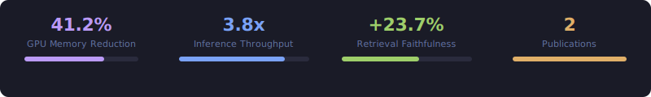

<p align="center">
  <a href="https://git.io/typing-svg">
    
  </a>
</p>

<div align="center">

[](https://tanaytammineni.vercel.app/)
[](https://linkedin.com/in/tanay-tammineni-ba6a9918b)
[](https://doi.org/10.5281/zenodo.19582347)
[](https://www.researchgate.net/publication/372595973)


</div>

<br/>

---


##  About Me

<table width="100%">
<tr>
<td valign="top" width="52%">

```python
#!/usr/bin/env python3
# tanay_tammineni.py

class AIEngineer:

    def __init__(self):
        self.name       = "Tanay Tammineni"
        self.role       = "AI Systems Engineer"
        self.education  = "MS CS @ SEMO · 3.9 GPA"
        self.location   = "Irving, TX · Open to Relocate"
        self.status     = "🟢 Open to Opportunities"

    @property
    def expertise(self):
        return {
            "LLM"  : ["QLoRA", "DeepSpeed ZeRO-3",
                      "vLLM", "Flash Attention 2"],
            "RAG"  : ["Qdrant", "Elasticsearch",
                      "Neo4j", "LangGraph", "CRAG"],
            "Data" : ["PySpark", "Databricks",
                      "SQL", "Pandas", "RAGAS"],
            "Cloud": ["AWS", "Docker",
                      "Terraform", "CI/CD"],
        }

    @property
    def achievements(self):
        return {
            "memory_reduction"  : "41.2% per-GPU",
            "throughput_gain"   : "3.8x on Llama 3 8B",
            "faithfulness_gain" : "+23.7% via RRF",
            "publications"      : 2,
            "gpa"               : 3.9,
        }

    def say_hi(self):
        print("I don't just build AI. I ship it.")


me = AIEngineer()
me.say_hi()
```

</td>
<td valign="top" width="48%" align="center">



<br/><br/>


</td>
</tr>
</table>

<br/>

---


## ⚡ Key Metrics

<div align="center">



</div>

<br/>

---


## 🔧 Currently Building

<div align="center">
<table>
<tr>
<td align="center" width="33%">


**🤖 JobAgent**


Zero-cost job application pipeline. Local Ollama · llama3.1:8b · SQLite · LaTeX. **No API calls. No cost.**

`Ollama` `SQLite` `Pandas` `LaTeX`

</td>
<td align="center" width="33%">


**🎙️ LiveWire AI Co-Pilot**


Chrome MV3 extension · Tab + mic capture · Whisper STT · Evidence packs.

`WebSocket` `FastAPI` `Whisper` `Chrome MV3`

</td>
<td align="center" width="33%">


**📄 UniLLMOps Framework**


Unified LLM production framework — fine-tuning to serving. Zenodo · Targeting arXiv cs.AI.

`LLM` `RAG` `CRAG` `RAGAS` `vLLM`

</td>
</tr>
</table>
</div>

<br/>

---


## 🛠️ Tech Stack

<div align="center">

**Core AI/ML**


**Infrastructure & Cloud**


**Databases & Search**


**Dev Tools**


<br/>


</div>

<br/>

---


## 🚀 Flagship Projects

<table>
<tr>
<td valign="top" width="50%">

<div align="center">

### [⚡ Distributed LLM Fine-Tuning Pipeline](https://github.com/TammineniTanay/distributed-finetune-pipeline)
</div>


| Metric | Result |
|--------|--------|
| 💾 Per-GPU memory | **−41.2%** via ZeRO-3 |
| ⚡ Throughput | **3.8x** on Llama 3 8B |
| 🔬 Techniques | DPO · TIES · DARE · SLERP |
| 📦 Infra | Prometheus · Grafana · CI/CD |

</td>
<td valign="top" width="50%">

<div align="center">

### [🔍 Production Hybrid RAG System](https://github.com/TammineniTanay/hybrid-rag-system)
</div>


| Metric | Result |
|--------|--------|
| 📈 Faithfulness gain | **+23.7%** via RRF |
| ⏱️ Retrieval latency | **163.5ms** mean |
| 🎯 Context precision | **1.0** |
| 🔄 CRAG rewrite rate | **38%** |

</td>
</tr>
<tr>
<td valign="top" width="50%">

<div align="center">

### [🤖 JobAgent](https://github.com/TammineniTanay/JobAgent)
</div>


Fully local automated job pipeline. Ingests Excel job feeds, filters roles, generates tailored resumes + cover letters — **zero external API calls.**

</td>
<td valign="top" width="50%">

<div align="center">

### [🚗 Real-Time Vehicle Detection](https://github.com/TammineniTanay/realtime-Vechile-Detection-using-AI)
</div>


Published in **CVR Journal of Science & Technology · June 2023.** Real-time detection + classification for intelligent traffic analysis.

</td>
</tr>
</table>

<br/>

---


## 💼 Experience

<table>
<tr>
<td valign="top" width="8%" align="center">

</td>
<td valign="top" width="92%">

**AI Systems Developer Intern** · VoiceBotics AI *(formerly Automate365)*

`Remote · Irving, TX` · Chrome MV3 · WebSocket · FastAPI · Whisper STT · Sprints 8–13 delivered

</td>
</tr>
<tr><td colspan="2"></td></tr>
<tr>
<td valign="top" align="center">

</td>
<td valign="top">

**Data Engineer Intern** · Globalshala

`Azure Databricks` · ETL pipelines · Power BI dashboards · SQL optimization · **99.9% uptime**

</td>
</tr>
</table>

<br/>

---


## 📄 Publications

<table>
<tr>
<td valign="top" width="50%">

<div align="center">

</div>

### 📘 UniLLMOps

**A Unified Framework for End-to-End LLM Production Systems**

[](https://doi.org/10.5281/zenodo.19582347)


> Distributed fine-tuning · Hybrid RAG · CRAG · RAGAS evaluation · vLLM serving at scale

**Verified Metrics:** 23.7% faithfulness gain · 41.2% GPU reduction · 3.8x throughput · 163.5ms latency

</td>
<td valign="top" width="50%">

<div align="center">

</div>

### 📗 Computer Vision Paper

**Real-Time Vehicle Detection & Classification**

[](https://www.researchgate.net/publication/372595973)


> OpenCV · Real-time multi-class detection · Traffic monitoring · Intelligent transportation

**Results:** 88% accuracy · 5,000+ frames · 🏆 3rd Prize at Project Expo2K23

</td>
</tr>
</table>

<br/>

---


## 🏅 Certifications

<div align="center">


</div>

<br/>

---


## 📊 GitHub Stats
<!--START_SECTION:waka-->
<!--END_SECTION:waka-->
<div align="center">


</div>

<div align="center">


</div>

<br/>

<div align="center">


</div>

<br/>

<div align="center">


</div>

<br/>

<div align="center">


</div>

<br/>

---


## 📬 Connect

<div align="center">

[](https://tanaytammineni.vercel.app/)
[](https://linkedin.com/in/tanay-tammineni-ba6a9918b)
[](https://doi.org/10.5281/zenodo.19582347)
[](https://www.researchgate.net/publication/372595973)

</div>

<br/>

<picture>
  <source media="(prefers-color-scheme: dark)" srcset="https://raw.githubusercontent.com/TammineniTanay/TammineniTanay/output/github-snake-dark.svg"/>
  <source media="(prefers-color-scheme: light)" srcset="https://raw.githubusercontent.com/TammineniTanay/TammineniTanay/output/github-snake.svg"/>
  
</picture>


